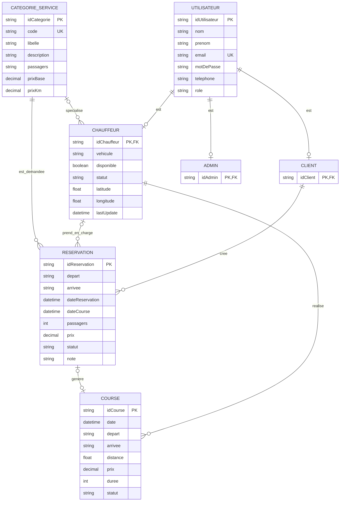

# MCD - Projet VTC Express

Ce MCD est construit a partir du frontend du projet et des donnees manipulees par l'API :
`chauffeurs`, `reservations` et `courses`.

## Regles de Gestion

- Un utilisateur possede un compte avec un role : client, chauffeur ou admin.
- Un client peut creer aucune, une ou plusieurs reservations.
- Une reservation appartient toujours a un seul client.
- Une reservation peut etre en attente, confirmee, en cours, terminee ou annulee.
- Une reservation peut ne pas encore avoir de chauffeur assigne.
- Un chauffeur peut accepter aucune, une ou plusieurs reservations.
- Une reservation demande une categorie de service : eco, confort ou van.
- Un chauffeur peut etre rattache a une categorie de service.
- Un chauffeur peut avoir une position geographique connue : latitude, longitude, derniere mise a jour.
- Une course est realisee par un chauffeur.
- Une reservation peut donner lieu a une course lorsque le trajet est effectue.

## Entites

### UTILISATEUR

| Attribut | Type | Remarque |
| --- | --- | --- |
| idUtilisateur | identifiant | Cle primaire |
| nom | texte | Obligatoire |
| prenom | texte | Obligatoire |
| email | texte | Unique |
| motDePasse | texte | A stocker sous forme hachee |
| telephone | texte | Obligatoire dans le formulaire |
| role | enum | admin, user/chauffeur, client |

### CLIENT

| Attribut | Type | Remarque |
| --- | --- | --- |
| idClient | identifiant | Cle primaire et cle etrangere vers UTILISATEUR |

### CHAUFFEUR

| Attribut | Type | Remarque |
| --- | --- | --- |
| idChauffeur | identifiant | Cle primaire et cle etrangere vers UTILISATEUR |
| vehicule | texte | Exemple : Mercedes Classe E |
| disponible | booleen | Disponibilite simple |
| statut | enum | disponible, en_course, en_pause, hors_service |
| latitude | nombre | Position actuelle, optionnelle |
| longitude | nombre | Position actuelle, optionnelle |
| lastUpdate | date/heure | Derniere mise a jour de position |

### ADMIN

| Attribut | Type | Remarque |
| --- | --- | --- |
| idAdmin | identifiant | Cle primaire et cle etrangere vers UTILISATEUR |

### CATEGORIE_SERVICE

| Attribut | Type | Remarque |
| --- | --- | --- |
| idCategorie | identifiant | Cle primaire |
| code | texte | eco, confort, van |
| libelle | texte | Eco, Confort, Van |
| description | texte | Description commerciale |
| passagers | texte | Exemple : 1-3 passagers |
| prixBase | nombre | Prix de depart |
| prixKm | nombre | Prix au kilometre |

### RESERVATION

| Attribut | Type | Remarque |
| --- | --- | --- |
| idReservation | identifiant | Cle primaire |
| depart | texte | Adresse de depart |
| arrivee | texte | Adresse d'arrivee |
| dateReservation | date/heure | Date de creation |
| dateCourse | date/heure | Date demandee pour la course |
| passagers | nombre | Nombre de passagers |
| prix | nombre | Prix estime ou final |
| statut | enum | en_attente, confirmee, en_cours, terminee, annulee |
| note | texte | Optionnel |

### COURSE

| Attribut | Type | Remarque |
| --- | --- | --- |
| idCourse | identifiant | Cle primaire |
| date | date/heure | Date de la course |
| depart | texte | Adresse de depart |
| arrivee | texte | Adresse d'arrivee |
| distance | nombre | Distance en km |
| duree | nombre | Duree en minutes |
| prix | nombre | Prix de la course |
| statut | enum | en_cours, terminee, annulee |

## Associations et Cardinalites

| Association | Cardinalite | Explication |
| --- | --- | --- |
| UTILISATEUR - CLIENT | UTILISATEUR (0,1), CLIENT (1,1) | Un utilisateur peut etre client ; un client est un utilisateur |
| UTILISATEUR - CHAUFFEUR | UTILISATEUR (0,1), CHAUFFEUR (1,1) | Un utilisateur peut etre chauffeur ; un chauffeur est un utilisateur |
| UTILISATEUR - ADMIN | UTILISATEUR (0,1), ADMIN (1,1) | Un utilisateur peut etre admin ; un admin est un utilisateur |
| CLIENT - RESERVATION | CLIENT (0,N), RESERVATION (1,1) | Un client peut faire plusieurs reservations ; une reservation a un seul client |
| CHAUFFEUR - RESERVATION | CHAUFFEUR (0,N), RESERVATION (0,1) | Un chauffeur peut accepter plusieurs reservations ; une reservation peut etre encore sans chauffeur |
| CATEGORIE_SERVICE - RESERVATION | CATEGORIE_SERVICE (0,N), RESERVATION (1,1) | Une reservation demande exactement une categorie |
| CATEGORIE_SERVICE - CHAUFFEUR | CATEGORIE_SERVICE (0,N), CHAUFFEUR (0,1) | Un chauffeur peut etre specialise dans une categorie |
| CHAUFFEUR - COURSE | CHAUFFEUR (0,N), COURSE (1,1) | Une course est realisee par un seul chauffeur |
| RESERVATION - COURSE | RESERVATION (0,1), COURSE (0,1) | Une reservation peut devenir une course ; cette relation est a ajouter si l'API doit historiser le lien |

## Diagramme Mermaid



## MLD Possible

```text
UTILISATEUR(
  id_utilisateur PK,
  nom,
  prenom,
  email UNIQUE,
  password_hash,
  telephone,
  role
)

CLIENT(
  id_client PK,
  id_utilisateur FK UNIQUE
)

CHAUFFEUR(
  id_chauffeur PK,
  id_utilisateur FK UNIQUE,
  id_categorie FK NULL,
  vehicule,
  disponible,
  statut,
  latitude,
  longitude,
  last_update
)

ADMIN(
  id_admin PK,
  id_utilisateur FK UNIQUE
)

CATEGORIE_SERVICE(
  id_categorie PK,
  code UNIQUE,
  libelle,
  description,
  passagers,
  prix_base,
  prix_km
)

RESERVATION(
  id_reservation PK,
  id_client FK NOT NULL,
  id_chauffeur FK NULL,
  id_categorie FK NOT NULL,
  depart,
  arrivee,
  date_reservation,
  date_course,
  passagers,
  prix,
  statut,
  note
)

COURSE(
  id_course PK,
  id_chauffeur FK NOT NULL,
  id_reservation FK NULL UNIQUE,
  date,
  depart,
  arrivee,
  distance,
  duree,
  prix,
  statut
)
```

## Remarques Pour Le Rapport

- Dans le code actuel, les clients, chauffeurs et admins semblent etre geres par une meme collection API appelee `chauffeurs`, avec un champ `role`.
- Pour un MCD clair, il est preferable de presenter une entite generale `UTILISATEUR`, puis les specialisations `CLIENT`, `CHAUFFEUR` et `ADMIN`.
- Le vehicule est actuellement un simple champ texte du chauffeur. Si le projet doit gerer plusieurs vehicules, des plaques d'immatriculation ou de la maintenance, il faudra creer une entite `VEHICULE`.
- La position du chauffeur est actuellement la derniere position connue. Si le projet doit suivre l'historique des positions, il faudra creer une entite `POSITION`.
- Les categories `eco`, `confort` et `van` sont actuellement definies dans le frontend. Pour une vraie application, elles peuvent devenir une table afin de modifier les tarifs sans redeployer le site.
